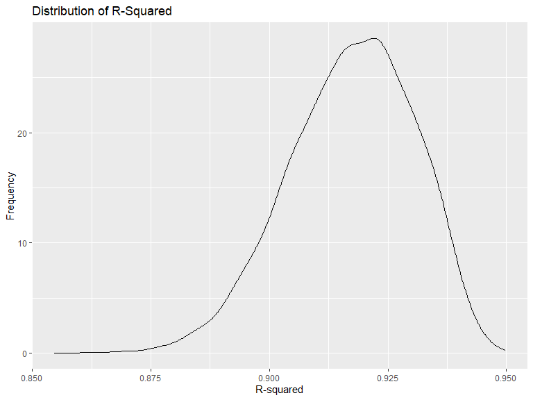
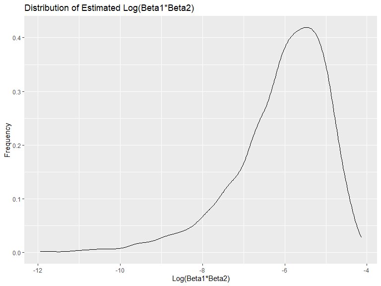

p8105_hw6_yb2591
================
Yige Bian (yb2591)
2023-12-01

# Problem 1

## Data cleaning

In the following data, we create `city_state` variable, `if_solved`
varaible to indicate whether the homicide is solved, omit cities
“Dallas, TX”, “Phoenix, AZ”, “Kansas City, MO”, “Tulsa, AL”, limit
`victim_race` with white or black, convert `victim_age` to numeric.

``` r
# data import and cleaning
homicide_data = read_csv("./homicide-data.csv") |>
  mutate(city_state = paste(city, state, sep = ", "),
         victim_age = as.numeric(victim_age),
         resolution = case_when(
      disposition == "Closed without arrest" ~ 0,
      disposition == "Open/No arrest"        ~ 0,
      disposition == "Closed by arrest"      ~ 1)) |>
  filter(!(city_state %in% c("Dallas, TX", "Phoenix, AZ", "Kansas City, MO", "Tulsa, AL")) & (victim_race %in% c("White", "Black")))
```

    ## Rows: 52179 Columns: 12
    ## ── Column specification ────────────────────────────────────────────────────────
    ## Delimiter: ","
    ## chr (9): uid, victim_last, victim_first, victim_race, victim_age, victim_sex...
    ## dbl (3): reported_date, lat, lon
    ## 
    ## ℹ Use `spec()` to retrieve the full column specification for this data.
    ## ℹ Specify the column types or set `show_col_types = FALSE` to quiet this message.

## Model for Baltimore

``` r
# further tidy the df
baltimore_df = homicide_data |>
  filter(city_state == "Baltimore, MD") |>
  select(resolution, victim_age, victim_sex, victim_race)
# develop model
p1_fit_bal = glm(resolution ~ victim_age + victim_sex + victim_race, data = baltimore_df, family = binomial())
# obtain OR and CI
p1_fit_bal |>
  broom::tidy()|> 
  mutate(
    OR = exp(estimate), 
    OR_CI_upper = exp(estimate + 1.96 * std.error),
    OR_CI_lower = exp(estimate - 1.96 * std.error)) |> 
  filter(term == c("victim_sexMale")) |> 
  select(term, OR, OR_CI_lower, OR_CI_upper) |>
  knitr::kable(digits = 3)
```

| term           |    OR | OR_CI_lower | OR_CI_upper |
|:---------------|------:|------------:|------------:|
| victim_sexMale | 0.426 |       0.325 |       0.558 |

## Model for all cities

``` r
# develop model for all cities, calculate OR and CI
p1_cities_model = homicide_data |>
  nest(data = -city_state) |> 
  mutate(
    models = map(data, \(df) glm(resolution ~ victim_age + victim_sex + victim_race, 
                             family = binomial(), data = df)),
    tidy_models = map(models, broom::tidy)) |> 
  select(-models, -data) |>
  unnest(cols = tidy_models) |> 
  mutate(
    OR = exp(estimate), 
    OR_CI_upper = exp(estimate + 1.96 * std.error),
    OR_CI_lower = exp(estimate - 1.96 * std.error)) |> 
  filter(term == "victim_sexMale") |> 
  select(term, city_state, OR, OR_CI_lower, OR_CI_upper)
```

The following plot shows the estimated ORs and CIs for each city

``` r
p1_cities_model |> 
  mutate(city_state = fct_reorder(city_state, OR)) |> 
  ggplot(aes(x = city_state, y = OR)) + 
  geom_point() + 
  geom_errorbar(aes(ymin = OR_CI_lower, ymax = OR_CI_upper)) + 
  theme(axis.text.x = element_text(angle = 90, hjust = 1))
```


# Problem 2

## Data import

``` r
# import df
weather_df = 
  rnoaa::meteo_pull_monitors(
    c("USW00094728"),
    var = c("PRCP", "TMIN", "TMAX"), 
    date_min = "2022-01-01",
    date_max = "2022-12-31") |>
  mutate(
    name = recode(id, USW00094728 = "CentralPark_NY"),
    tmin = tmin / 10,
    tmax = tmax / 10) |>
  select(name, id, everything())
```

    ## using cached file: C:\Users\Bryce\AppData\Local/R/cache/R/rnoaa/noaa_ghcnd/USW00094728.dly

    ## date created (size, mb): 2023-10-22 16:45:04.100241 (8.551)

    ## file min/max dates: 1869-01-01 / 2023-10-31

## Bootstrape and calculate quantities

``` r
# define function for boot sample
boot_sample = function(df) {
  sample_frac(df, replace = TRUE)
}

# define function to calculate quantities
cal_quantities = function(df){
  fit = lm(tmax ~ tmin + prcp, data = df)
  
  r_sq = pull(broom::glance(fit), r.squared)
  log_b1b2 = fit |>
    broom::tidy() |>
    filter(!(term %in% "(Intercept)")) |>
    pull(estimate) |>
    prod() |>
    log()
  
  return(tibble(
    r_squared = r_sq,
    log_b1b2 = log_b1b2))
}
# implement bootsrap
boot_straps = 
  tibble(strap_number = 1:5000) |>
  mutate(
    strap_sample = map(strap_number, \(i) boot_sample(df = weather_df))
  ) |>
  mutate(quantities = map(strap_sample, cal_quantities)) |>
    unnest(quantities)
```

## Plot quantities

``` r
# plot R-squared
boot_straps |>
  ggplot(aes(x = r_squared)) + 
  geom_density() +
  labs(x = "R-squared", y = "Frequency") +
  ggtitle("Distribution of R-Squared")
```



``` r
# plot log()
boot_straps |>
  drop_na(log_b1b2) |>
  ggplot(aes(x = log_b1b2)) + 
  geom_density() +
  labs(x = "Log(Beta1*Beta2)", y = "Frequency") +
  ggtitle("Distribution of Estimated Log(Beta1*Beta2)")
```



The bootstrap estimated r square gives the range 0.855, 0.95, mean
0.917, and the plot shows that most estimated values are around 0.92,
which shows that the model has a good fit of the data.

The plot of $log(\hat{\beta}_1*\hat{\beta}_2)$ shows an obvious left
skewing, with the range NaN, NaN, and most of the values were around
-5.5. We noticed that there are na in the value of
$log(\hat{\beta}_1*\hat{\beta}_2)$ due to the negative result of the
product of $\hat{\beta}_1$ and $\hat{\beta}_2$.

## 95% confidence interval

``` r
# calculate 95% CI for two quantities
ci_rsquared <- quantile(pull(boot_straps, r_squared), c(0.025, 0.975))
ci_logb1b2 <- quantile(pull(boot_straps, log_b1b2), c(0.025, 0.975), na.rm = TRUE)

ci_rsquared
```

    ##      2.5%     97.5% 
    ## 0.8891343 0.9397846

``` r
ci_logb1b2
```

    ##      2.5%     97.5% 
    ## -8.985353 -4.518581

The 95% CI for $\hat{r}^2$ is (0.89, 0.94), and 95% CI for
$log(\hat{\beta}_1*\hat{\beta}_2)$ is \[-9.06, -4.54\]

# Problem 3

## Data cleaning

Firstly, we load and clean the data. All variables are converted to
appropriate type and there is no missing value through checking.

``` r
# import and clean data
birthweight = read_csv("./birthweight.csv") |>
  mutate(
    babysex = case_match(babysex,
      1 ~ "male",
      2 ~ "female"
    ),
    frace = case_match(frace,
      1 ~ "White",
      2 ~ "Black",
      3 ~ "Asian",
      4 ~ "Puerto Rican",
      8 ~ "Other",
      9 ~ "Unknown"
    ),
    malform = case_match(malform,
      0 ~ "absent",
      1 ~ "present"
    ),
    mrace = case_match(mrace,
      1 ~ "White",
      2 ~ "Black",
      3 ~ "Asian",
      4 ~ "Puerto Rican",
      8 ~ "Other"))
```

    ## Rows: 4342 Columns: 20
    ## ── Column specification ────────────────────────────────────────────────────────
    ## Delimiter: ","
    ## dbl (20): babysex, bhead, blength, bwt, delwt, fincome, frace, gaweeks, malf...
    ## 
    ## ℹ Use `spec()` to retrieve the full column specification for this data.
    ## ℹ Specify the column types or set `show_col_types = FALSE` to quiet this message.

Then use skim method to check the dataframe

``` r
skimr::skim(birthweight)
```

|                                                  |             |
|:-------------------------------------------------|:------------|
| Name                                             | birthweight |
| Number of rows                                   | 4342        |
| Number of columns                                | 20          |
| \_\_\_\_\_\_\_\_\_\_\_\_\_\_\_\_\_\_\_\_\_\_\_   |             |
| Column type frequency:                           |             |
| character                                        | 4           |
| numeric                                          | 16          |
| \_\_\_\_\_\_\_\_\_\_\_\_\_\_\_\_\_\_\_\_\_\_\_\_ |             |
| Group variables                                  | None        |

Data summary

**Variable type: character**

| skim_variable | n_missing | complete_rate | min | max | empty | n_unique | whitespace |
|:--------------|----------:|--------------:|----:|----:|------:|---------:|-----------:|
| babysex       |         0 |             1 |   4 |   6 |     0 |        2 |          0 |
| frace         |         0 |             1 |   5 |  12 |     0 |        5 |          0 |
| malform       |         0 |             1 |   6 |   7 |     0 |        2 |          0 |
| mrace         |         0 |             1 |   5 |  12 |     0 |        4 |          0 |

**Variable type: numeric**

| skim_variable | n_missing | complete_rate |    mean |     sd |     p0 |     p25 |     p50 |     p75 |   p100 | hist  |
|:--------------|----------:|--------------:|--------:|-------:|-------:|--------:|--------:|--------:|-------:|:------|
| bhead         |         0 |             1 |   33.65 |   1.62 |  21.00 |   33.00 |   34.00 |   35.00 |   41.0 | ▁▁▆▇▁ |
| blength       |         0 |             1 |   49.75 |   2.72 |  20.00 |   48.00 |   50.00 |   51.00 |   63.0 | ▁▁▁▇▁ |
| bwt           |         0 |             1 | 3114.40 | 512.15 | 595.00 | 2807.00 | 3132.50 | 3459.00 | 4791.0 | ▁▁▇▇▁ |
| delwt         |         0 |             1 |  145.57 |  22.21 |  86.00 |  131.00 |  143.00 |  157.00 |  334.0 | ▅▇▁▁▁ |
| fincome       |         0 |             1 |   44.11 |  25.98 |   0.00 |   25.00 |   35.00 |   65.00 |   96.0 | ▃▇▅▂▃ |
| gaweeks       |         0 |             1 |   39.43 |   3.15 |  17.70 |   38.30 |   39.90 |   41.10 |   51.3 | ▁▁▂▇▁ |
| menarche      |         0 |             1 |   12.51 |   1.48 |   0.00 |   12.00 |   12.00 |   13.00 |   19.0 | ▁▁▂▇▁ |
| mheight       |         0 |             1 |   63.49 |   2.66 |  48.00 |   62.00 |   63.00 |   65.00 |   77.0 | ▁▁▇▂▁ |
| momage        |         0 |             1 |   20.30 |   3.88 |  12.00 |   18.00 |   20.00 |   22.00 |   44.0 | ▅▇▂▁▁ |
| parity        |         0 |             1 |    0.00 |   0.10 |   0.00 |    0.00 |    0.00 |    0.00 |    6.0 | ▇▁▁▁▁ |
| pnumlbw       |         0 |             1 |    0.00 |   0.00 |   0.00 |    0.00 |    0.00 |    0.00 |    0.0 | ▁▁▇▁▁ |
| pnumsga       |         0 |             1 |    0.00 |   0.00 |   0.00 |    0.00 |    0.00 |    0.00 |    0.0 | ▁▁▇▁▁ |
| ppbmi         |         0 |             1 |   21.57 |   3.18 |  13.07 |   19.53 |   21.03 |   22.91 |   46.1 | ▃▇▁▁▁ |
| ppwt          |         0 |             1 |  123.49 |  20.16 |  70.00 |  110.00 |  120.00 |  134.00 |  287.0 | ▅▇▁▁▁ |
| smoken        |         0 |             1 |    4.15 |   7.41 |   0.00 |    0.00 |    0.00 |    5.00 |   60.0 | ▇▁▁▁▁ |
| wtgain        |         0 |             1 |   22.08 |  10.94 | -46.00 |   15.00 |   22.00 |   28.00 |   89.0 | ▁▁▇▁▁ |

## Model development

Firstly, we supposed that the birthweight is associated with babay’s
health status and characteristics (babysex, bhead, blength, gaweeks,
malform), mom’s health status and characteristics (delwt, momage, ppmbi,
smoken, wtgain), financial status (fincome)

``` r
# initial development of our model
model_one = lm(bwt ~ babysex + bhead + blength + gaweeks + delwt + malform + momage + ppbmi + smoken + wtgain, data = birthweight)

model_one |>summary()
```

    ## 
    ## Call:
    ## lm(formula = bwt ~ babysex + bhead + blength + gaweeks + delwt + 
    ##     malform + momage + ppbmi + smoken + wtgain, data = birthweight)
    ## 
    ## Residuals:
    ##      Min       1Q   Median       3Q      Max 
    ## -1091.29  -184.57    -6.58   173.44  2487.90 
    ## 
    ## Coefficients:
    ##                  Estimate Std. Error t value Pr(>|t|)    
    ## (Intercept)    -6128.4801    98.6068 -62.151  < 2e-16 ***
    ## babysexmale      -31.3638     8.6602  -3.622 0.000296 ***
    ## bhead            135.5780     3.5099  38.627  < 2e-16 ***
    ## blength           77.4693     2.0611  37.586  < 2e-16 ***
    ## gaweeks           12.8900     1.4922   8.638  < 2e-16 ***
    ## delwt              3.2274     0.4125   7.825 6.36e-15 ***
    ## malformpresent    25.6869    72.3519   0.355 0.722586    
    ## momage             6.4358     1.1229   5.731 1.06e-08 ***
    ## ppbmi            -12.6145     2.5838  -4.882 1.09e-06 ***
    ## smoken            -2.6232     0.5796  -4.526 6.17e-06 ***
    ## wtgain             0.7588     0.5801   1.308 0.190967    
    ## ---
    ## Signif. codes:  0 '***' 0.001 '**' 0.01 '*' 0.05 '.' 0.1 ' ' 1
    ## 
    ## Residual standard error: 279.3 on 4331 degrees of freedom
    ## Multiple R-squared:  0.7033, Adjusted R-squared:  0.7026 
    ## F-statistic:  1026 on 10 and 4331 DF,  p-value: < 2.2e-16

After fitting the first model, we observed that malform and wtgain is
not statistical significant for the model, so we delete these two
variables and fit a new model.

``` r
# Develop model with new factors
model_two = lm(bwt ~ babysex + bhead + blength + gaweeks + delwt + momage + ppbmi + smoken, data = birthweight)

model_two |>summary()
```

    ## 
    ## Call:
    ## lm(formula = bwt ~ babysex + bhead + blength + gaweeks + delwt + 
    ##     momage + ppbmi + smoken, data = birthweight)
    ## 
    ## Residuals:
    ##      Min       1Q   Median       3Q      Max 
    ## -1087.35  -183.44    -6.37   174.60  2481.40 
    ## 
    ## Coefficients:
    ##               Estimate Std. Error t value Pr(>|t|)    
    ## (Intercept) -6124.0104    98.5499 -62.141  < 2e-16 ***
    ## babysexmale   -30.9564     8.6548  -3.577 0.000352 ***
    ## bhead         135.7629     3.5072  38.710  < 2e-16 ***
    ## blength        77.4074     2.0605  37.567  < 2e-16 ***
    ## gaweeks        13.0137     1.4889   8.740  < 2e-16 ***
    ## delwt           3.6169     0.2869  12.605  < 2e-16 ***
    ## momage          6.2195     1.1097   5.604 2.22e-08 ***
    ## ppbmi         -14.8462     1.9470  -7.625 2.98e-14 ***
    ## smoken         -2.6295     0.5792  -4.540 5.78e-06 ***
    ## ---
    ## Signif. codes:  0 '***' 0.001 '**' 0.01 '*' 0.05 '.' 0.1 ' ' 1
    ## 
    ## Residual standard error: 279.3 on 4333 degrees of freedom
    ## Multiple R-squared:  0.7031, Adjusted R-squared:  0.7026 
    ## F-statistic:  1283 on 8 and 4333 DF,  p-value: < 2.2e-16

Now, all variables are significantly associated with birthweight and we
use this as our final model.

## Residuals and predictions

``` r
# add resiquals and predictions, and plot
birthweight |>
  add_residuals(model_two) |>
  add_predictions(model_two) |>
  ggplot(
    aes(x = pred ,y = resid)
  )+
  geom_point()+
  labs(title = "Residuals vs Predictions", x = "Predictions", y = "Residuals")
```


The plot shows that the fitted values show slightly unstable predictions
when the birthweight is too small. Most residuals shows random pattern
around 0.

## Model comparison

Now we use cross validation to evluate our model and other two models.

``` r
# Implement cross validation
cv_df = crossv_mc(birthweight, 10) |> # use cross validation with 10 folds
  mutate( # split train and test sets
    train = map(train, as_tibble),
    test = map(test, as_tibble))|>
  mutate( # fit three models
    our_model =  map(train, \(df) lm(bwt ~ babysex + bhead + blength + gaweeks + delwt + momage + ppbmi + smoken, data = birthweight)),
    sample_model_one = map(train, \(df) lm(bwt ~ blength + gaweeks, data = birthweight)),
    sample_model_two = map(train, \(df) lm(bwt ~ bhead + blength + babysex + bhead*blength + bhead*babysex + blength*babysex + bhead*blength*babysex, data = birthweight))) |>
  mutate( # calculate rmse for each model
    rmse_our_model = map2_dbl(our_model, test, \(mod, df) rmse(model = mod, data = df)),
    rmse_sample_model_one = map2_dbl(sample_model_one, test, \(mod, df) rmse(model = mod, data = df)),
    rmse_sample_model_two = map2_dbl(sample_model_two, test, \(mod, df) rmse(model = mod, data = df)))
```

``` r
# draw the plot to compare rmse
cv_df |> 
  select(starts_with("rmse")) |> 
  pivot_longer(
    everything(),
    names_to = "model", 
    values_to = "rmse",
    names_prefix = "rmse_") |> 
  mutate(model = fct_inorder(model)) |> 
  ggplot(aes(x = model, y = rmse)) + geom_violin() +
  stat_summary(fun = "mean", color = "black")
```


From the plot, it is obvious that in general, our model shows lower rmse
than two sample models, and our model also shows the lowest mean of
rmse.
